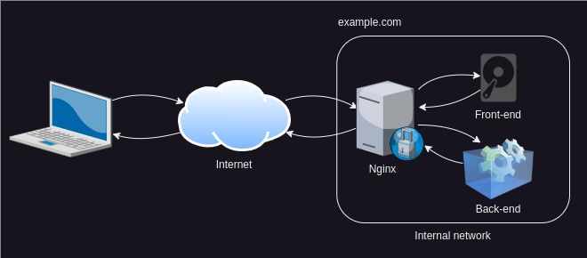

# Host an SPA with Nginx

## Introduction

Most modern front-end frameworks only load a single HTML page that reference
the client application as a JavaScript bundle.
They do the rendering and navigation purely in JavaScript.
That is what a single-page application (SPA) is.

To host an SPA, you need an HTTP server that serves static content.
Static meaning there is no server side state or logic.
So basically plain old files.

Many services exist that can serve SPAs.
The easiest (I know of) is [Firebase
Hosting](https://firebase.google.com/docs/hosting/).

In this tutorial however, we will set up hosting for an SPA the old-school way.
With an HTTP server configured manually on a Linux server.
To save costs we will use a [virtual machine
(VM)](https://en.wikipedia.org/wiki/Virtual_machine) instead of dedicated
hardware.

The tutorial is meant to give you a glimpse into what it is like to
administrate a Linux server.
It is based on a practical use-case for people developing web applications.

You don't need to clone the repository.
Just follow the instructions.

## Create a VM

Create a VM in [VirtualBox](https://www.virtualbox.org/), UTM or use a cloud
provider of your choosing.

The guide is based on Ubuntu Server 24.04 LTS.

Guides for creating a VM:

- [Create an Ubuntu VM with VirtualBox (or UTM)](./docs/virtualbox-vm.md)
- [Create an Ubuntu VM on Google Cloud](./docs/google-cloud-vm.md).

**IMPORTANT: If using a cloud provider you will need to clean up all created
resources when done. Otherwise, you could end up spending all your initial
free-credit or worst case have reoccurring charges.**

## Setup nginx

All commands from here on are executed on the server.
Typically, you would use [SSH](https://en.wikipedia.org/wiki/Secure_Shell) to
access a shell on a remote server over an encrypted (secure) connection.

Most cloud providers provide a way to get a shell on a VM with just a single
button click.

Find some way to get a console on your VM.
Then let's get started!

First we need a web-server.
There are a couple of options such as Apache, Lighttpd, Nginx and so on.
We are going with Nginx since it is widely used.

```sh
# Install nginx
# NOTE: `-y` answer yes to all questions
sudo apt -y install nginx
# Verify that it is running with
systemctl status nginx
```

_Lines beginning with # are comments and not something you should type into the shell._

You should see something like this:

```
● nginx.service - A high performance web server and a reverse proxy server
     Loaded: loaded (/usr/lib/systemd/system/nginx.service; enabled; preset: enabled)
     Active: active (running) since Wed 2024-08-14 20:11:43 UTC; 1min 13s ago
```

You can see the HTML for default site in nginx (sort of a hello-world site) by typing:

```sh
curl http://localhost
```

You can try to access it by typing the IP of your VM in your browser.


Note: If you are using a VM on a cloud provider, you typically need to allow
traffic on port 80 (HTTP).
For security reasons all traffic to VMs are blocked by default.
Depending on the cloud provider, where you allow traffic could be called
firewall, security-group, network rule etc.

## Copy SPA to VM

To host an SPA on with nginx you need to copy the files to the server somehow.
There are a couple of different ways it can be done.
Popular options are:

- FTP (file transfer protocol). Requires additional setup.
- SCP (secure file copy) - copy over SSH. Requires you have to `scp` locally
  and a way to authenticate on the server.
- HTTP. Requires that you have another server to host the files.

For this tutorial, we will go with HTTP.
I have already prepared a demo application that you can find a download link
for [here](https://github.com/rpede/tutorial-vm-spa/releases).

To download it to the VM, run:

```sh
wget "https://github.com/rpede/tutorial-vm-spa/releases/download/1.0.0/release.zip"
```

On Linux, [gzip](https://en.wikipedia.org/wiki/Gzip) compressed
[tarballs](<https://en.wikipedia.org/wiki/Tar_(computing)>) are the most used format for compressed-archives.
More common than the ZIP file format.
So, we need to install a small additional tool to extract the ZIP archive.

```sh
sudo apt -y install unzip
```

The default configuration for nginx serves static files from `/var/www/html`.
So, to start serving our SPA, we can just extract the archive to that directory.

```sh
# Remove default site
sudo rm /var/www/html/index.nginx-debian.html
# Extract the ZIP file
sudo unzip release.zip -d /var/www/html
```

The `/var/www/html` folder is owned by `root` (super-admin in Linux world).
So, we need `sudo` as prefix for the `unzip` command to execute it with root
privileges.
You can check the permissions with `ls -l /var/www/html/`.
Notice the only HTML file in the folder is `index.html`.

## Test with default configuration

Load the site in your browser by typing your VMs external IP into your address
bar.


The app is incredibly simple.
It just has a single button that navigates to a different route.


It looks like everything is working fine initially.
But if you reload the `/about` page, then you just get this ugly "404 Not
Found".


When you first entered the address `http://your-vm-ip/` the server
translates the path `/` to `index.html` and responds with the content of that
file.
The HTML in the file contains a reference to some JavaScript.
This JavaScript is the code for the SPA.
When you click the button it will change the content that is rendered without
touching the web-server.
Then when you hit "reload", since the address now is `/about`, it will make
a request to the server for a `about` (or `about.html`) page.
Remember, we only have a `index.html`.
There is no `/about` page on the server, so it will respond with generic 404
page.


## Configure for SPA

To get links and reloading working for the SPA, we need to configure the
web-server to respond with `index.html` for all paths that doesn't match a
file.
The `index.html` references JavaScript which will determine what to show to the
user based on the given route/path.

We can change the default configuration with:

```sh
# First make a backup copy of the configuration
sudo cp /etc/nginx/sites-available/default nginx.bak
# Then edit the file
sudoedit /etc/nginx/sites-available/default
```

A single instance of Nginx can handle multiple sites with different
configuration.
In such a setup, there will be multiple domain names pointing to the same IP.
Nginx can determine which configuration to use based on the domain name.
However, in our simple example, we just have one site and no domain names.

Find the line that says:

```nginx
               try_files $uri $uri/ =404;
```

And change it to:

```nginx
               try_files $uri $uri/ /index.html;
```

Press <kbd>CTRL</kbd>+<kbd>o</kbd> to save (write out), then
<kbd>CTRL</kbd>+<kbd>x</kbd> to exit.

The text editor you just used is [
nano](https://en.wikipedia.org/wiki/GNU_nano).
There are also two other well known text-editors on Linux (and UNIX), they are
[vim](<https://en.wikipedia.org/wiki/Vim_(text_editor)>) and
[Emacs](https://en.wikipedia.org/wiki/Emacshttps://en.wikipedia.org/wiki/Emacs).
Both much more powerful than nano.
In fact, so powerful that they can be configured in ways that rival most IDEs.
However, they also have a [steep learning
curve](https://tech.serhatteker.com/img/content/2022/vim-learning-curve.jpeg).

Anyway.
You can test that the nginx configuration is valid with:

```sh
sudo nginx -t
```

Now, reload the configuration with:

```sh
sudo systemctl reload nginx
```

The `systemctl` command is used to manage services on modern Linux.
The first step in diagnosing an issue with a service is by running `systemctl
status nginx`.

Try the page again.
Test it in the same way you did earlier.


Reloading or navigating directly to a sub-page should work now.

## Closing thoughts

Instead of Nginx, we could also have used Apache, Lighttpd or something else.
They all have many features in addition to just serving static files.
Such as:

- [Virtual hosting](https://en.wikipedia.org/wiki/Virtual_hosting)
- [TLS encryption](https://en.wikipedia.org/wiki/Transport_Layer_Security)
- [HTTP compression](https://en.wikipedia.org/wiki/HTTP_compression)
- [Execute CGI scripts](https://en.wikipedia.org/wiki/Common_Gateway_Interface)
- [Forwarding](https://en.wikipedia.org/wiki/Proxy_server#Web_proxy_servers)

A common use-case for Nginx is as an entry point for internet traffic.
Depending on requested path it can, either serve files for front-end directly from disk, or forward to one or more back-ends.
All while managing things like encryption, compression and caching.
The HTTP-server of your back-end framework can also be configured to do these things, but Nginx (and others like it) will often perform better for those tasks.
It will also take some load of your back-end.


