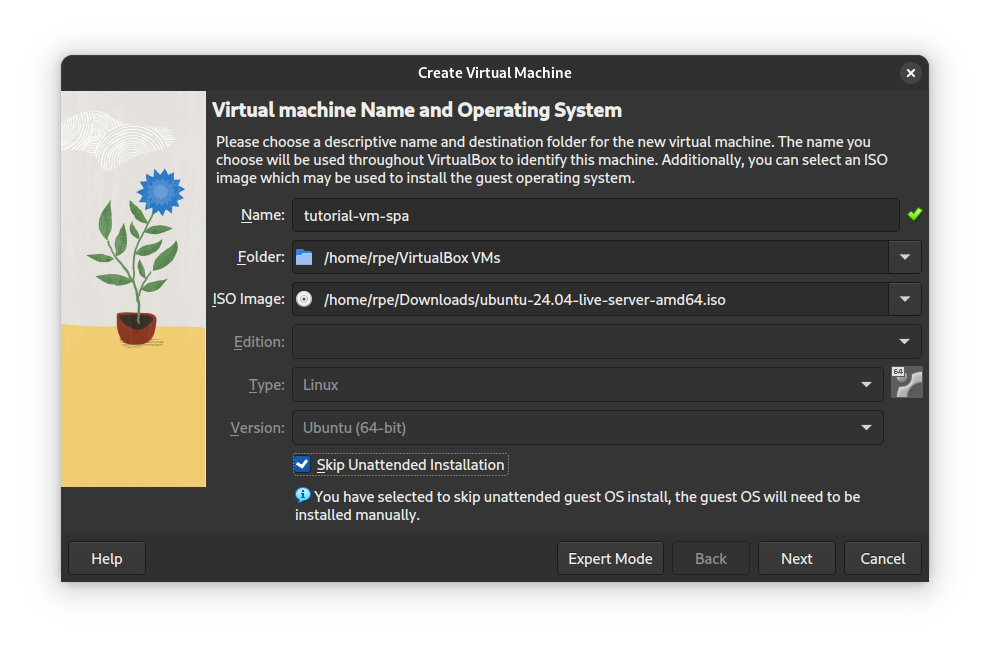
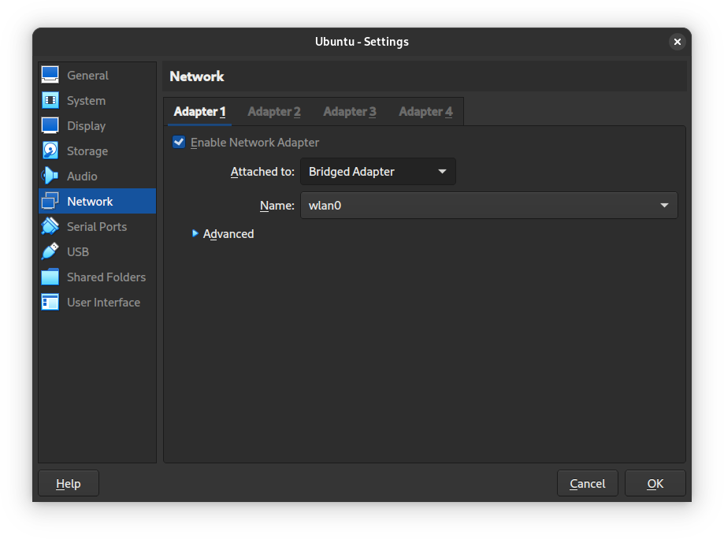
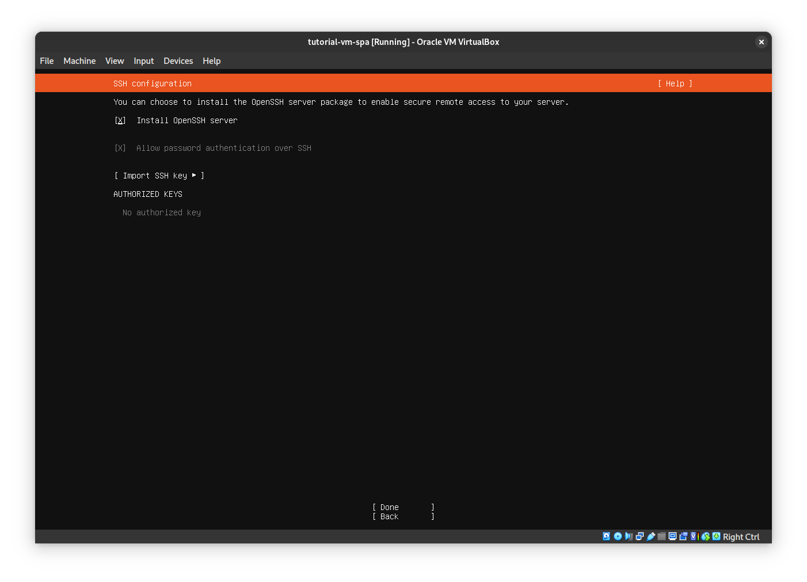

# Create an Ubuntu VM in VirtualBox

[Download VirtualBox](https://www.virtualbox.org/wiki/Downloads) and install
it.

_I recommend using [UTM](https://mac.getutm.app/) instead on Apple Silicon._

Then download Ubuntu Server 24.04 LTS from
<https://ubuntu.com/download/server#manual-install>.

_Get the ARM version for Apple Silicon._

Start VirtualBox.
Click "New" button.
Select the `.iso` file you just downloaded in the "ISO Image" field.
And check "Skip Unattended Installation".
Then "Next" through the rest of the steps.

When you're done with the wizard a new window will pop up with the screen of
the VM.
At this point you need to open the Settings dialog and change the network
adapter to bridged.

Using bridged network adapter allows you to connect to ports on the VM from
your host OS.

Now in the window with the VM screen.
Select your keyboard layout of choice.

Then type a username and password that you can remember.
Accept the defaults until you get to the "SSH configuration" screen.
Here you want to check [x] "Install OpenSSH server".

Keep accepting the defaults until "Installation complete!", then "Reboot Now".

After reboot, you can login with your credentials.
Take note of the IPv4 address shown, since you'll need it for later.
Congrats! You now got yourself a VM running Ubuntu Server.

Navigate back to the main guide and continue.
