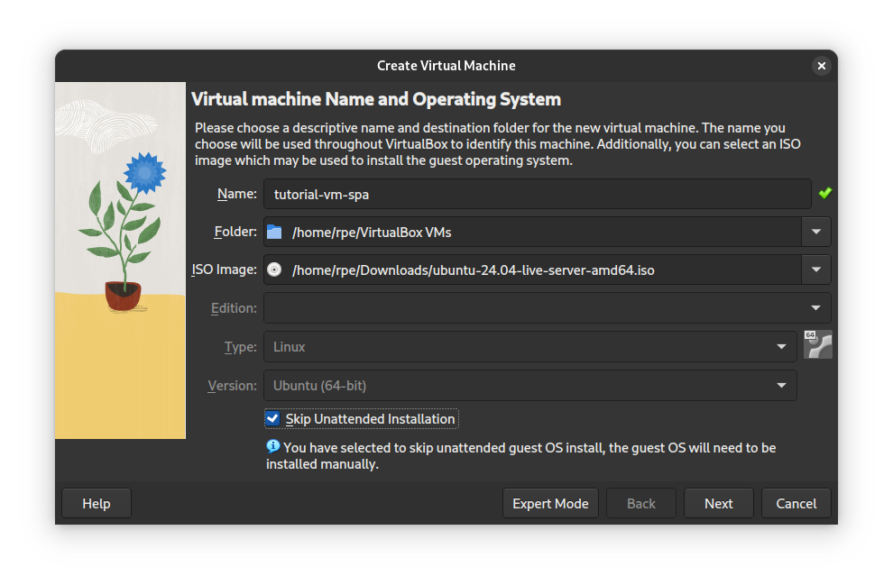
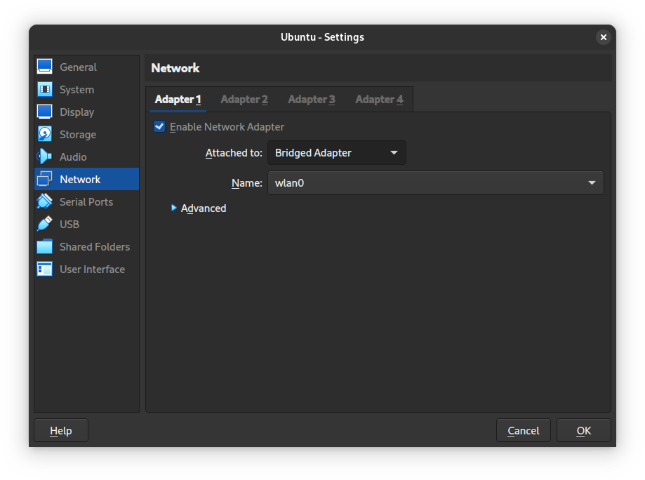

# Create an Ubuntu VM in VirtualBox

[Download VirtualBox](https://www.virtualbox.org/wiki/Downloads) and install
it.

1. Open VirtualBox.
2. Click "New" button.
3. Select the `.iso` file you just downloaded in the "ISO Image" field.
4. And check "Skip Unattended Installation".
5. Then "Next" through the rest of the steps.

When you're done with the wizard a new window will pop up with the screen of
the VM.
At this point you need to open the Settings dialog and change the network
adapter to bridged.

Using bridged network adapter allows you to connect to ports on the VM from
your host OS.

Click "Start" to start the VM.

Next, [Install Ubuntu Server](./install-ubuntu.md).
